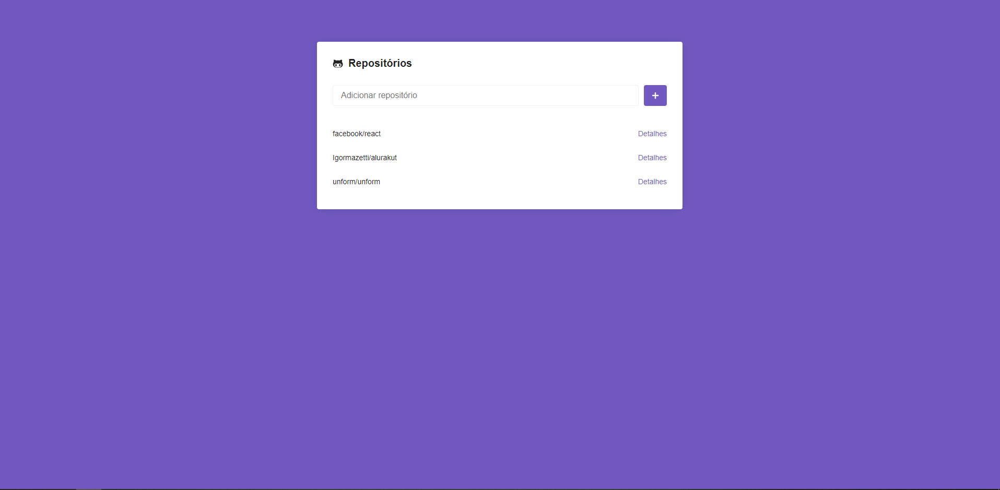
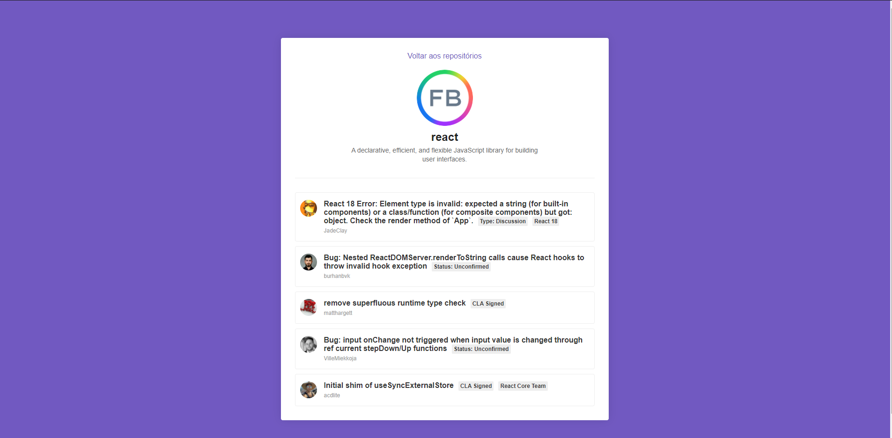

<p align="center">
  
  

</p>

## :bookmark: About the project

ReactJS - Application used to find repositories in GitHub, developed at Rocketseat bootcamp.

## 🚀 Technologies

Technologies that I used to develop this web client

- [React Native](https://reactnative.dev/)
- [React Router Dom](https://www.npmjs.com/package/react-router-dom)
- [Styled Components](https://styled-components.com/)
- [Axios](https://axios-http.com/docs/intro)
- [PropTypes](https://pt-br.reactjs.org/docs/typechecking-with-proptypes.html)
- Environment variables

## 💻 Getting started

### Requirements

**Clone the project and access the folder**

```bash
$ git clone https://github.com/igormazetti/RepositorySeeker.git && cd RepositorySeeker
```

**Follow the steps below**

```bash
# Install the dependencies
$ yarn
```

Run the project

```bash
$ yarn start
```

---

Made by Igor Mazetti 👋 [See my linkedin](https://www.linkedin.com/in/igor-mazetti-de-azevedo-147679ba/)
